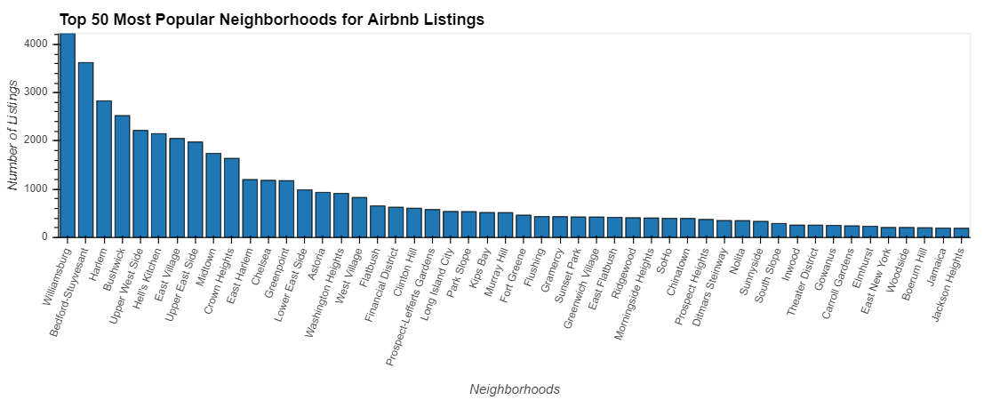

The Airbnb Alternative

Objective
To understand the Airbnb market in NYC as it compares to the hotel industry and real estate rental industry. 

To provide tourists a guid as to which neighborhoods or zip codes Airbnb offers better value as opposed to hotels.
To provide homeowners and hosts / potential hosts a guide as to which neighborhoods offer better value as opposed to the traditional real estate rental market.

Understanding where Airbnb is, and where the best value is for customers or tourists.

From this visualization we can see that manhattan is the most popular borough for Airbnb, but Brooklyn is not far behind. Queens, Bronx and Staten Island lag signifigantly. 

Here we can see that in Manhattan the most popular listing type is "Entire Home/apt" while in Brooklyn, the most popular listing type is "Private room".

So while Manhattan may have most listings than Brooklyn. The neighborhoods in north east Brooklyn,  Williamsburg, Bedford-Stuyvesant and Bushwick make up 3 out of the top for most popular areas for Airbnb listings. 

This chart here shows us the most expensive listings on average by neighborhood. Williamsburg was far and away the neighborhood with the most listings but also ranks as the 50th most expensive neighborhood. This is an indicator of good value. It seems as though the competition in this neighborhood has pushed down the average price per night.

If we look at neighborhoods by review score we can see that the top scored neighborhoods are all in Brooklyn. A Manhattan neighborhood doesnt come ito the picture until "Nolita" at about 20.

I took the intersection of the two attributes, price and review score to get a list of neighborhoods that fell into "Best of Both Worlds" and "Worst of Both Worlds". The best neighborhoods should offer customers a better value as they have low prices and high scores. The worst neighborhoods are ones to avoid, as prices are high and review scores are low.

Then we used the hotel data to compare average nightly prices of hotels to the Airbnbs by zip code. We created an index value which is essentially the hotel average nightly price minus the Airbnb nightly price in each neighborhood. 

These are the top 50 zip codes where hotels are on average more expensive than Airbnb listings. 

Zip codes where Hotels are on avg over $400 more expensive:
10021-Upper East Side
10022-Upper East Side
10023-Lincoln Square
10019-Midtown
10028-Upper East Side
10065 Upper East Side

Here is a visualization of the bottom 50 index values

Zip codes where Airbnb is on avg more expensive:
11357  Whitestone Queens
11238 Prospect Heights
10013 Tribeca
11213 Crown Heights
10282 Battery Park City
11231 Red Hook
10029 East Harlem
11365 Auburndale
10301 Silver Lake  Staten Island
10014 West Village

It seems as though Airbnb may be the better option in certain Brooklyn Neighborhoods, such as Brooklyn Heights, Williamsburg or Greenpoint. Although this may be true, Prospect Heights and Red Hook, also in Brooklyn, may offer more value in terms of hotel. Avoid Airbnb in Tribeca and West Village. Also it seems you may be able to find some good value around Central Park, Upper East and West Sides, in terms of price.

As far as compaing real estaes values to airbnb prices. We found a strong correlation between the two, with a .71 correlation coefficient.

These zip codes break out of that correlation offering more value to the homeowners/hosts, with Airbnb prices being much better than traditional rental prices. We may even recommend listing your home on Airbnb instead of using the rental market 

These zip codes break that correlation the other way, offering more value for the customer. We may even recommend looking for rentals on Airbnb instead of using the traditional rental market. 

Airbnb vs. Average rent analysis 

